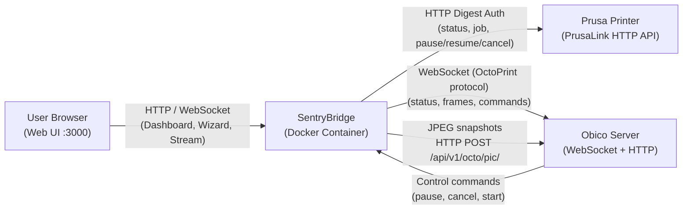

# 3. System Scope and Context

## Context Diagram

SentryBridge sits between three external actors: the Prusa printer (PrusaLink), the Obico server, and the user's browser.

## External Interfaces

### PrusaLink (Prusa Printer)

- **Protocol:** HTTP/1.1 with HTTP Digest Authentication
- **Polling endpoints:** `GET /api/v1/status` (telemetry), `GET /api/v1/job` (active job)
- **Control endpoints:** `PUT /api/v1/job/{id}/pause`, `PUT /api/v1/job/{id}/resume`, `DELETE /api/v1/job/{id}`
- **File management:** `GET /api/v1/files`, `POST /api/v1/files`, `DELETE /api/v1/files/{path}`
- **Auth credentials:** username `maker`, password from printer display

### Obico Server

- **Protocol:** WebSocket (`wss://{server}/ws/dev/`), Bearer token in upgrade header
- **Outgoing:** JSON status messages every 30 s + on state change; JPEG frames via HTTP POST
- **Incoming:** Control command messages (`target/func/args` format)
- **Pairing:** 5-character code displayed in wizard; confirmed via polling `/api/v1/octo/verify/`

### Camera (Buddy3D Board)

- **Protocol:** RTSP (`rtsp://[printer-ip]/live`)
- **Consumer:** ffmpeg subprocess captures stream, emits JPEG frames at configurable interval
- **Note:** Unauthenticated, LAN-only; not part of PrusaLink API

### User Browser

- **Web UI:** React SPA served at `http://{docker-host}:3000`
- **API:** Express REST routes under `/api/` (config, bridge control, file management, health)
- **Stream:** MJPEG stream at `/stream`, WebRTC via Janus (`10100–10200/udp`)
