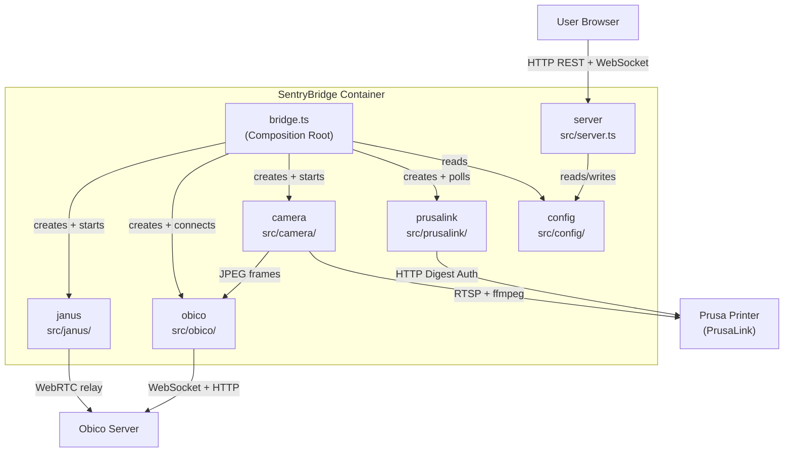

# 5. Building Block View

## Level 1 — System Decomposition

SentryBridge is decomposed into four core modules plus two supporting components. The `bridge` module is the composition root that wires them all together.

## Module Responsibilities

### config (`src/config/`)

Reads and writes the JSON configuration file from the Docker volume (`/config/config.json`). Exposes `loadConfig()`, `saveConfig()`, `isConfigured()`, and a `configEmitter` that fires `config-changed` events when the config is saved. The bridge subscribes to this event to apply hot-reload.

### prusalink (`src/prusalink/`)

HTTP Digest Auth client for the PrusaLink API. Created per config; all requests go through a single `request()` helper that is covered by the circuit breaker. Responsibilities: poll printer status and active job, relay pause/resume/cancel commands, provide file management (list, upload, start print, delete).

### camera (`src/camera/`)

Manages an ffmpeg subprocess that reads the RTSP stream and emits JPEG frames at a configurable interval. Subscribers register via `onFrame(cb)`. Also manages an RTP output stream used by the Janus relay. Handles graceful shutdown (`stopGracefully(timeoutMs)`) and crash recovery.

### obico (`src/obico/`)

WebSocket client that connects to `wss://{server}/ws/dev/` with a Bearer token. Implements the OctoPrint agent protocol: pairing flow, periodic status messages, JPEG frame upload, command dispatch (pause/resume/cancel/start). Maintains an `activePrintFileId` closure state that survives reconnects.

### janus (`src/janus/`)

Two sub-components:
- **janusManager**: lifecycle management for the bundled Janus WebRTC gateway process
- **janusRelay**: bridges the camera RTP stream into a Janus video room and signals the Obico server

### bridge (`src/bridge.ts`)

Composition root. Creates all modules, wires frame forwarding (`camera.onFrame → agent.sendFrame`), starts the polling interval (`setInterval → pollAndSend`), subscribes to config changes, and implements `reconnectComponent()` for manual recovery from the dashboard.

### server (`src/server.ts`)

Express application. Serves the compiled React SPA as static files under `/`. Mounts API routes under `/api/` (config, bridge control, file proxy, health, MJPEG stream). Starts `startBridge()` on boot if the system is configured.
