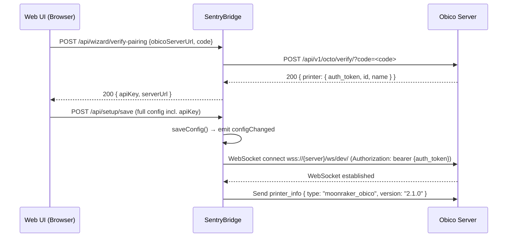
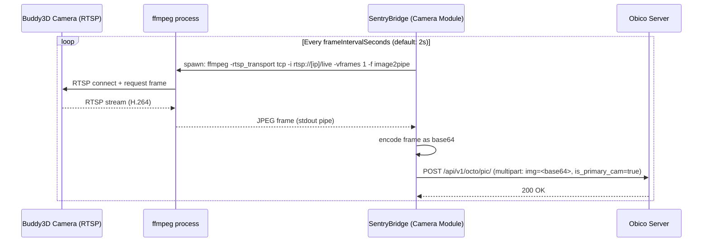
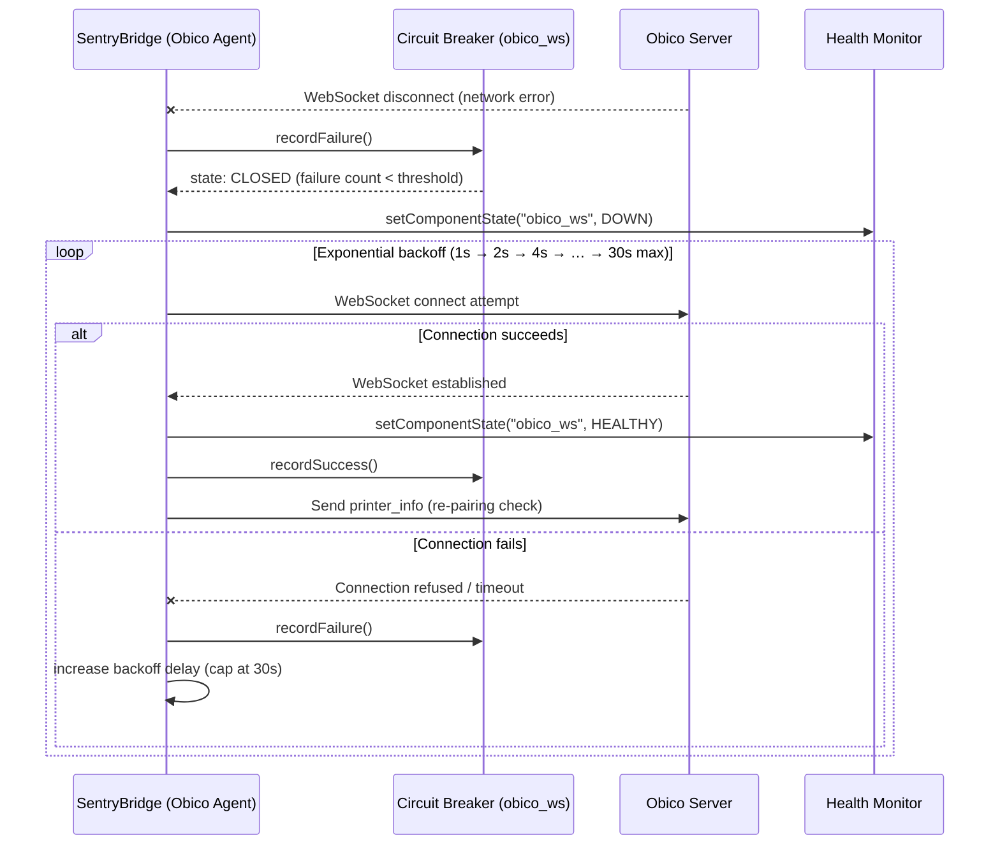
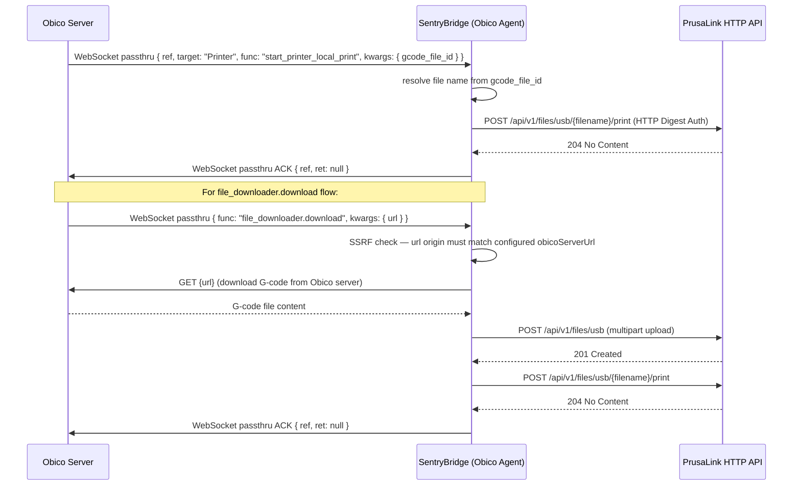
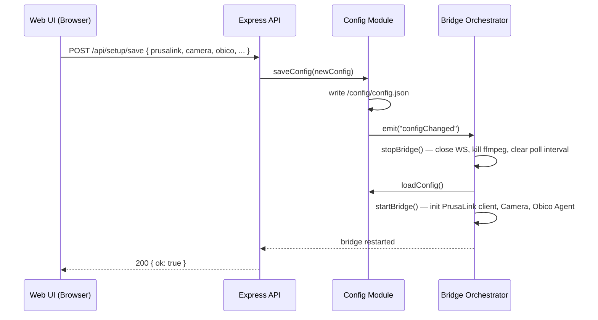
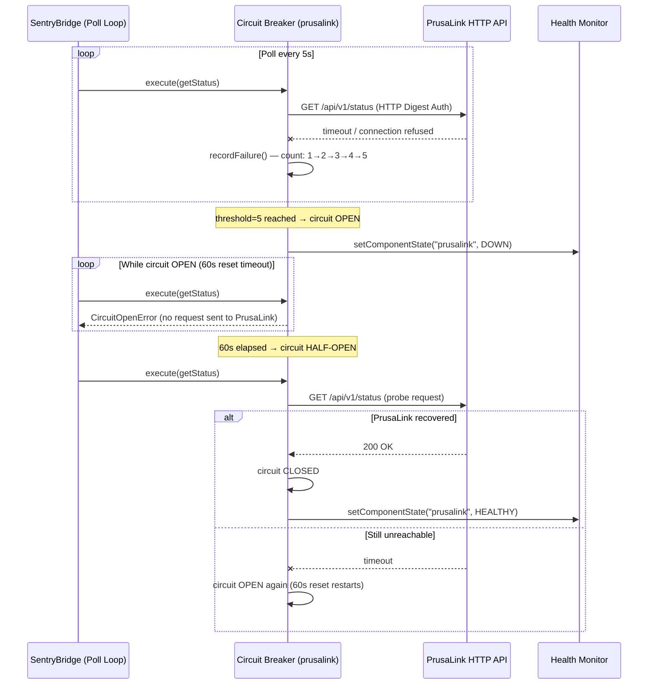

# Chapter 6: Runtime View

This chapter documents six key runtime scenarios that illustrate how SentryBridge behaves during operation. Each scenario is shown as a Mermaid sequence diagram.

---

## Scenario 1: Pairing Flow

The initial pairing establishes the connection between SentryBridge and the Obico server. The wizard triggers this flow after the user configures PrusaLink and camera.

---

## Scenario 2: Frame Loop

After pairing, SentryBridge continuously captures camera frames and forwards them to Obico for AI failure detection.

---

## Scenario 3: Reconnect Flow

When the Obico WebSocket connection drops, SentryBridge reconnects with exponential backoff.

---

## Scenario 4: Print-Start Flow

Obico sends a print command (from the Obico control panel or file library). SentryBridge dispatches it to PrusaLink and sends a ref-matched ACK.

---

## Scenario 5: Config Hot-Reload

When the user saves a new configuration through the dashboard, the bridge tears down all active connections and reinitialises with the new config.

---

## Scenario 6: Circuit Breaker Trip

When PrusaLink becomes unreachable, the circuit breaker opens after 5 consecutive failures, preventing further requests until the reset timeout expires.

