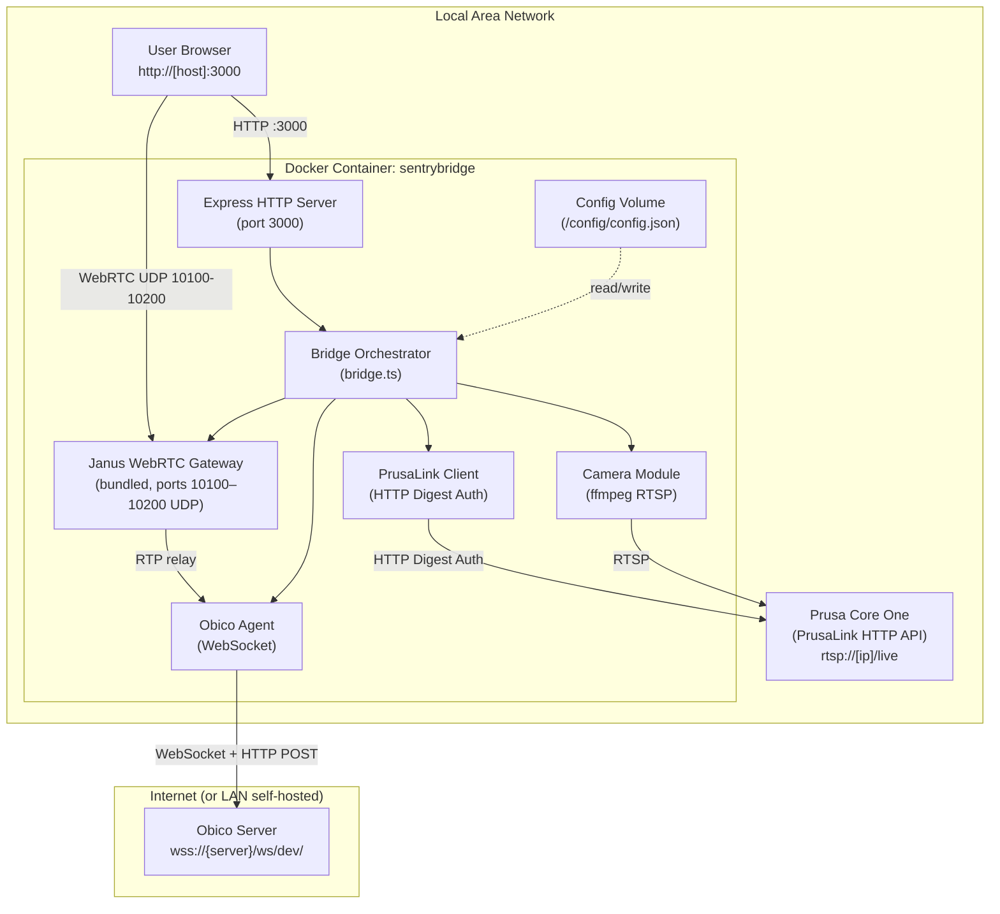

# Chapter 7: Deployment View

## Infrastructure

SentryBridge runs as a **single Docker container** on the user's LAN. One container instance manages exactly one Prusa printer.

## Deployment Configuration

| Concern            | Configuration                                                                    |
| ------------------ | -------------------------------------------------------------------------------- |
| Container port     | `3000` (HTTP)                                                                    |
| WebRTC ports       | `10100–10200/udp` (Janus ICE media)                                              |
| Config persistence | Docker volume mounted at `/config`                                               |
| LAN IP for WebRTC  | `JANUS_HOST_IP` environment variable (required for WebRTC)                       |
| Restart policy     | `unless-stopped` recommended                                                     |
| Grace period       | `stop_grace_period: 30s` (SIGTERM → ffmpeg shutdown)                             |
| Health check       | `GET /api/health/live` — Docker liveness probe                                   |
| Readiness check    | `GET /api/health/ready` — returns 503 when critical component is DOWN for > 120s |

## Scaling

One container = one printer. To monitor multiple printers, run multiple container instances on different host ports (e.g., 3000, 3001, 3002), each with its own config volume.

## Platform Support

Multi-platform Docker image: `linux/amd64` + `linux/arm64`. Tested on Unraid (AMD64) and Raspberry Pi 4 (ARM64).
